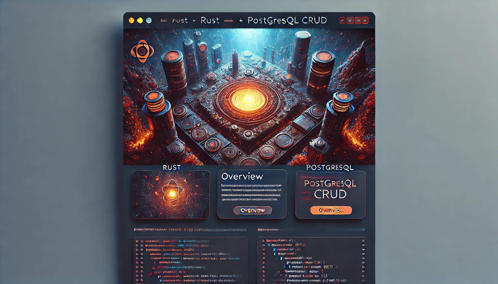

# Rust + PostgreSQL CRUD Application




## BADGES SECTION


## Overview

This project demonstrates how to set up and run a Rust application with a PostgreSQL database. By following the instructions below, you'll be able to build and deploy your Rust application with CRUD (Create, Read, Update, Delete) functionality using PostgreSQL.

## Prerequisites

Must be installed on your local machine

- [PostgreSQL](https://www.postgresql.org/download/) 
- [Rust](https://www.rust-lang.org/tools/install) 
- [Tokio](https://tokio.rs/)


## Installation

### 1. Clone the Repository

First, clone this repository to your local machine:

```sh
git clone https://github.com/NogutiCode/LoungeServer.git
cd LoungeServer

cargo build
cargo run

```

You should see output indicating the server is running on http://127.0.0.1:7878.

## Project Structure

```sh
LoungeServer/
├── Cargo.toml
├── Cargo.lock
├── hello.html
├── 404.html
├── src
│   └── main.rs
└── static
    ├── styles
    │   └── styles.css
    ├── js
    │   └── script.js
    └── user.html
├── db
│   └── mod.rs
├── handlers
│   └── mod.rs
│   └── user.rs
├── model
│   └── mod.rs
│   └── user.rs


```


- **Cargo.toml** - Rust project configuration file.
- **Cargo.lock** - Dependency lock file.
- **src/main.rs** - Main Rust application source file.
- **static/styles/styles.css** - JavaScript file for client-side scripting.
- **static/js/script.js** - HTML file served for user-related paths.
- **db/mod.rs** - Database module.
- **handlers/mod.rs** - Request handlers module.
- **handlers/user.rs** - User-related request handlers.
- **model/mod.rs** - Data models module.
- **model/user.rs** - User data model.


## .env Configuration

``` sh 
DATABASE_HOST="DATABASE_HOST"
DATABASE_NAME="DATABASE_NAME"
DATABASE_USER="DATABASE_USER"
DATABASE_PASSWORD="DATABASE_PASSWORD"
DATABASE_PORT="DATABASE_PORT"

```

pub async fn create_pool() -> Pool {
    dotenv().ok();
    
    let mut cfg = Config::new();
    cfg.host = Some(env::var("DATABASE_HOST").expect("DATABASE_HOST must be set"));
    cfg.dbname = Some(env::var("DATABASE_NAME").expect("DATABASE_NAME must be set"));
    cfg.user = Some(env::var("DATABASE_USER").expect("DATABASE_USER must be set"));
    cfg.password = Some(env::var("DATABASE_PASSWORD").expect("DATABASE_PASSWORD must be set"));
    cfg.port = Some(env::var("DATABASE_PORT").expect("DATABASE_PORT must be set").parse().expect("DATABASE_PORT must be a number"));
    
    cfg.create_pool(NoTls).unwrap()
}

## License
This project is licensed under the MIT License. See the LICENSE file for details.

